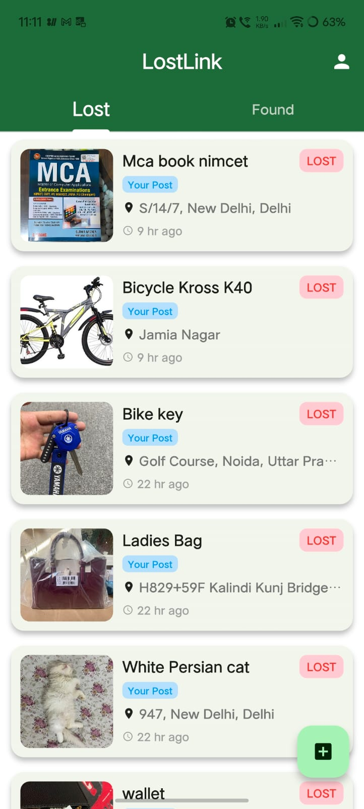
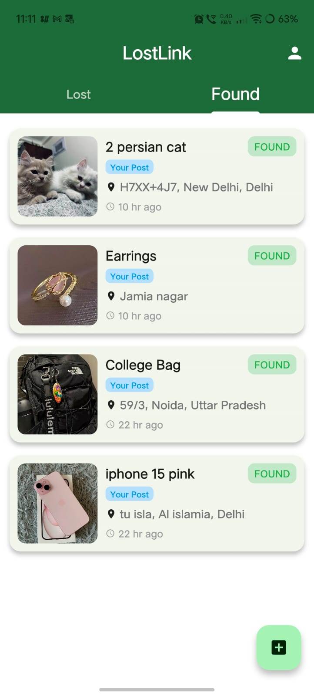
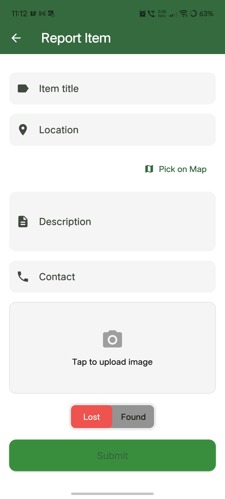
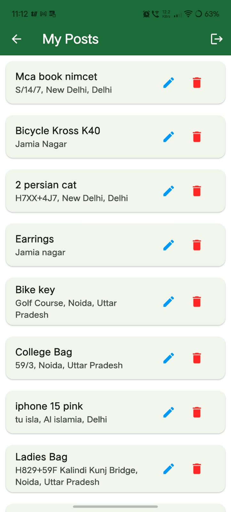
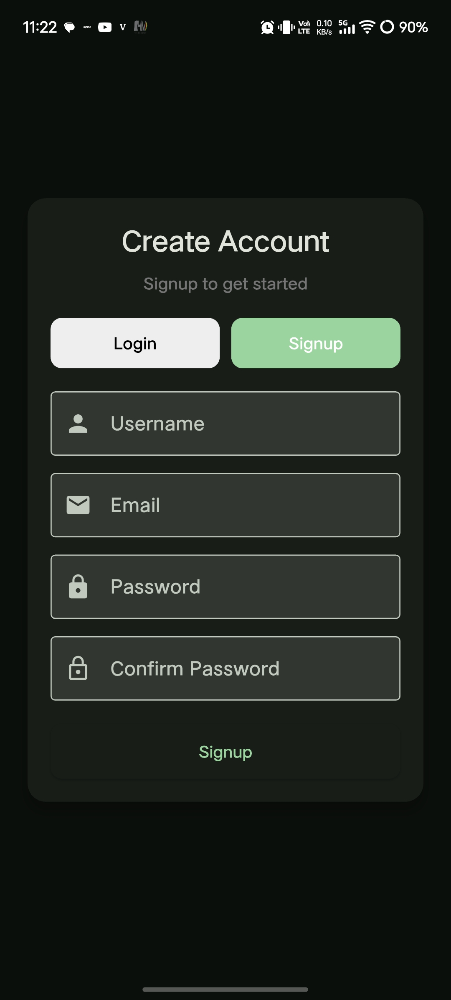

# Lost & Found Community App

Flutter-based lost and found app with Firebase backend, real-time feed, image uploads, and location support.

## Screenshots

### Feed
<p align="center">
  
  
</p>
<p align="center"><sub>Lost Items | Found Items</sub></p>

### Actions
<p align="center">
  
  
</p>
<p align="center"><sub>Report Item | My Posts</sub></p>

### Authentication
<p align="center">
  
</p>
<p align="center"><sub>Login / Signup</sub></p>

---
## Run Locally

Clone the repository:

```bash
git clone https://github.com/Myselfrizz/lost-and-found-app.git
cd lost-and-found-app
```

Install dependencies

```bash
 flutter pub get
```
Configure Firebase:
- Create a Firebase project
- Add `google-services.json`:
```
  android/app/
```
Run the App:

```bash
  flutter run
```


## Documentation

### Overview

This application enables users to report and browse lost or found items using a real-time backend powered by Firebase.

---

### Core Components

- **Authentication**
  - Firebase Authentication is used to identify users
  - Each post is associated with a `userId`

- **Firestore (Database)**
  - Collection: `items`
  - Stores item details (title, description, location, image URL, etc.)
  - Real-time updates via Firestore streams

- **Firebase Storage**
  - Stores uploaded images
  - Path structure:
    ```
    user_uploads/{userId}/{timestamp}.jpg
    ```

- **Feed System**
  - Built using `StreamBuilder`
  - Listens to Firestore updates in real time
  - Filters items by type (`lost` / `found`)

---

### Data Flow

1. User authenticates
2. User selects an image and enters item details
3. Image is uploaded to Firebase Storage
4. Download URL is generated
5. Data is stored in Firestore
6. Feed updates automatically via stream

---

### Error Handling

- Image loading errors handled with fallback UI
- Null or invalid data safely handled in UI components

---

### Security

- Authentication required for database and storage access
- Storage scoped per user (`user_uploads/{userId}`)
- API keys restricted via Google Cloud Console
---
## Deployment

Build a release APK:

```bash
flutter build apk --release
```


The generated file will be available at:
```
build/app/outputs/flutter-apk/app-release.apk
```

Download APK:

https://drive.google.com/file/d/1E-YPfwGTG1FKawLk3EOevZZ7pIY32jae/view

Note:
- Enable installation from unknown sources on the device before installing
- This method is intended for testing and manual distribution
---
## Support
If you find any issues or have suggestions, feel free to open an issue or submit a pull request.
